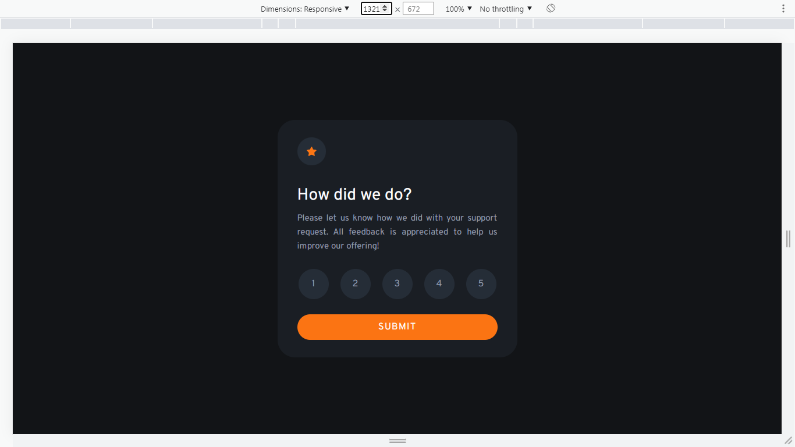
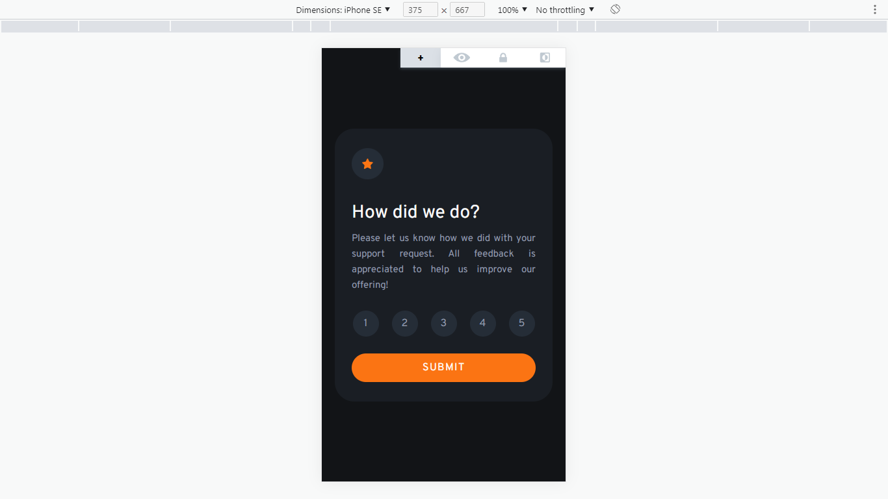
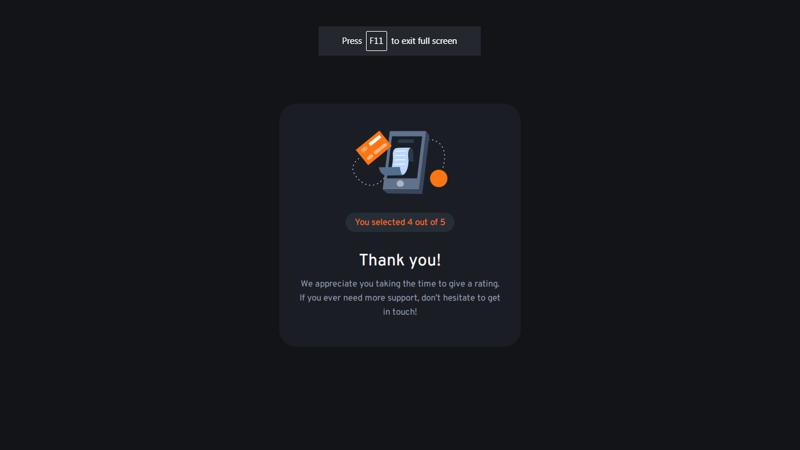
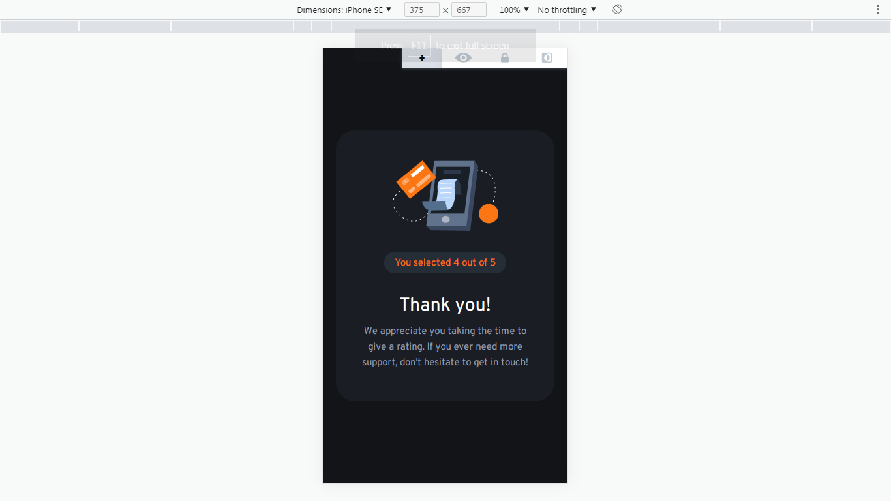

# Frontend Mentor - Interactive rating component solution

This is a solution to the [Interactive rating component challenge on Frontend Mentor](https://www.frontendmentor.io/challenges/interactive-rating-component-koxpeBUmI). Frontend Mentor challenges help you improve your coding skills by building realistic projects. 

## Table of contents

- [Overview](#overview)
  - [The challenge](#the-challenge)
  - [Screenshot](#screenshot)
  - [Links](#links)
- [My process](#my-process)
  - [Built with](#built-with)
  - [What I learned](#what-i-learned)

- [Author](#author)


## Overview

### The challenge

Users should be able to:

- View the optimal layout for the app depending on their device's screen size
- See hover states for all interactive elements on the page
- Select and submit a number rating
- See the "Thank you" card state after submitting a rating

### Screenshot






### Links

- Solution URL: [solution](https://github.com/varunUk09/HTML_PRACTICE_PROJECTS/tree/master/interactive-rating-component)
- Live Site URL: [live](https://varunuk09.github.io/HTML_PRACTICE_PROJECTS/interactive-rating-component/)

## My process

### Built with

- Semantic HTML5 markup
- CSS custom properties


### What I learned

I learned how to deselect a radio button ,see below:

```js
let clickedTimes = 0;
document.querySelectorAll("form input[name='rating-radio']").forEach((ratingRadioBtn) => {
    ratingRadioBtn.addEventListener('click', function() {
      if(this.checked == true && clickedTimes == 1){
        this.checked = false;
        clickedTimes = 0;
      } else {
        clickedTimes = 1;
      }
    });
});
```


## Author

- Frontend Mentor - [@varunUk09](https://www.frontendmentor.io/profile/varunUk09)


